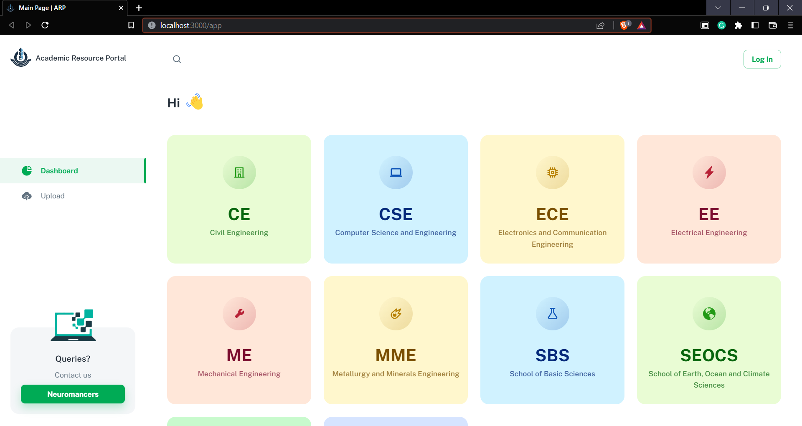
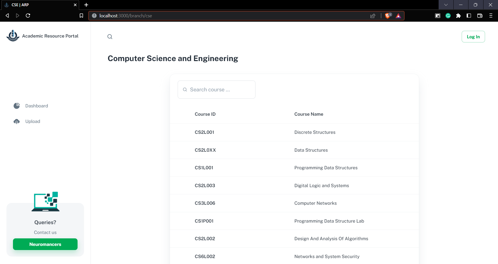
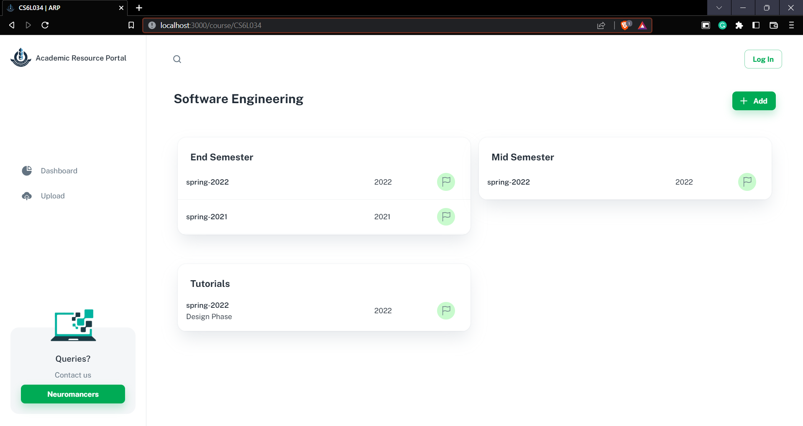
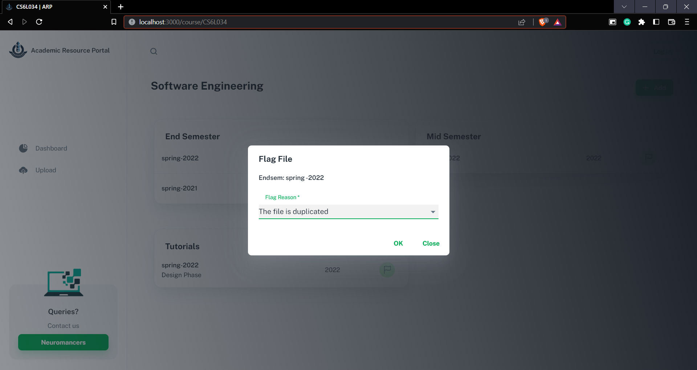
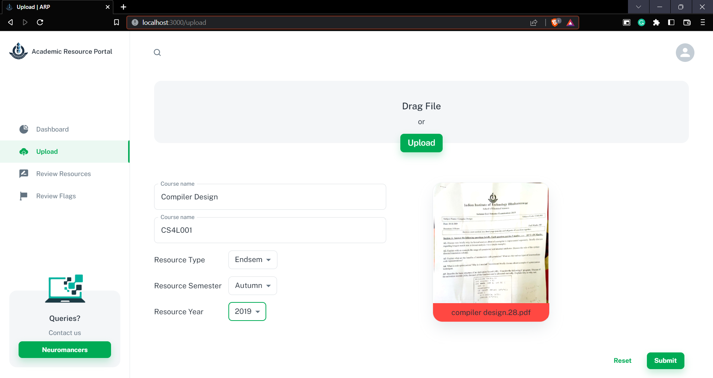
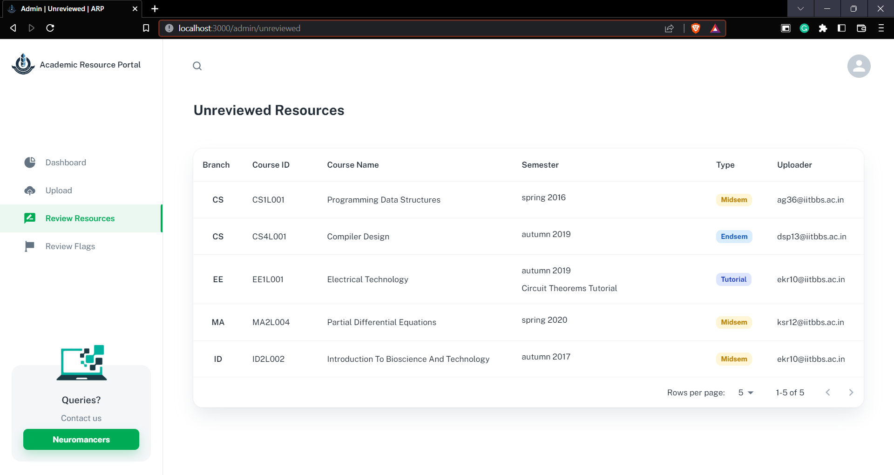
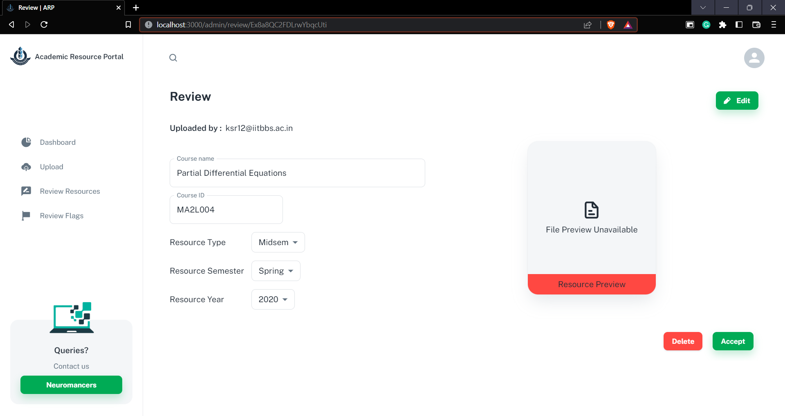
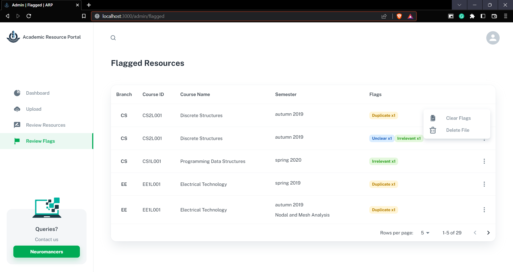
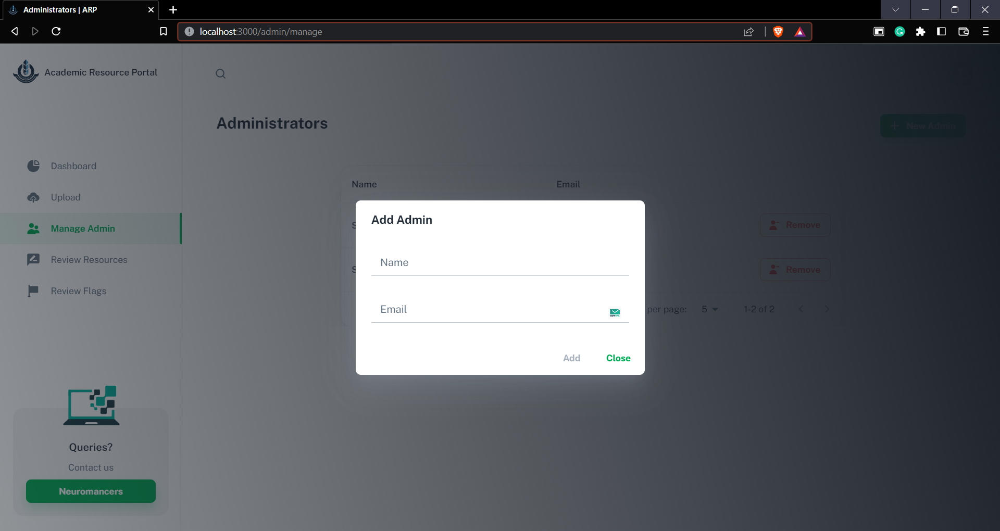

# Academic Resource Portal, IIT Bhubaneswar

Hosted Website: https://arpiitbbs.firebaseapp.com

**Revamp of the Academic Resource Portal of IIT Bhubaneswar to a complete frontend web application using React JS and Google Firebase.**

## Table of Contents

- [Previous Repositories](#previous-repositories)
- [Built With](#built-with)
- [Functionalities](#functionalities)
- [Features](#features)
- [Web Pages](#web-pages)
- [Running the webapp locally](#running-the-webapp-locally)
- [Contributors](#contributors)

## Previous Repositories

- [Frontend repository](https://github.com/NeuromancersIITBBS/AcademicResourcePortal)
- [Backend repository](https://github.com/NeuromancersIITBBS/ARP_Backend)

## Built With

- Frontend Framework - [React](https://reactjs.org/)
- Database, Storage and Hosting - [Google Firebase](https://firebase.google.com/)

## Functionalities

- A portal which would host academic resources exclusively for the students of IIT Bhubaneswar.

- One can upload and download resources helpful for Academic purposes, like Question papers, Tutorials, Quizzes, Materials etc., with the help of this portal.

- The Admins would examine the resources before uploading to ensure users receive the correct content.

## Features

- Google Sign-in enabled with authentication, allowing only the IIT Bhubaneswar community to upload resources.

- Resources can be flagged by users if found inappropriate, along with specifying the reason for flagging it.

- Compatible with all kinds of devices (with the help of Material UI).

- Exclusive Admin page consisting of various functions to ease the work of Admins monitoring the resources and providing the correct information to the Users.

- Exclusive Super Admin page consisting of functions to manage admins in the system.

## Web Pages

The website includes the Home Section and Upload Sections, with exclusive sections displayed for admins and super admin after authentication.

### Home Section

- The home section consists of all the uploaded resources arranged according to the School or Branch of the subject of each resource.

- The section consists of Search Bar. Search is done by simple substring checking.

- Clicking on specific branches displays its section consisting of a list of all its courses.

<p align="center">
  
</p>

### Branch Page

<p align="center">
  
</p>

- Selecting a course would load its course division.

### Course Page

- The course page displays the course's resources in different cards based on their type.
- Clicking on resource would trigger the download resource call.
- There are also options to flag a resource.

<p align="center">
  
</p>
<br/>
<p align="center">
  
</p>

### Upload Files Section

- The upload form consists of a container containing various details of the resource to be filled in by the user.

- Uploading a file requires Google Sign-in, which is restricted to only the IIT Bhubaneswar community.

- The PDF is uploaded to the firebase storage, and the downloadable link is appended to the form data stored in the Firestore database.

- The uploaded files will be marked as unreviewed and sent to the admin page for review.

<p align="center">
  
</p>

### Admin Pages

Only the Admins of the project can access these pages.

### Review Resources

- Admins monitor the uploaded resources which are unreviewed.

- The page has options to delete a file, change the information in a form data and mark a file as reviewed.

- The app would upload the reviewed files approved by the admins to the main page.

<p align="center">
  
</p>
<br/>

<p align="center">
  
</p>

### Flagged Resources

- Admins can check the uploaded resources the users flagged and the reasons for flagging.

- The page has options to delete a file and clear flags of a file.

<p align="center">
  
</p>

### Super Admin Page

Only super admin can access this page. The super admin can add or remove admins using the interface.

<p align="center">
  
</p>
<br/>

<p align="center">
  
</p>

## Running the WebApp locally

Install the Node Package Manager latest version.

```
$ npm install npm@latest-g
```

Fork this repo and clone it.

```
$ git clone https://github.com/<Your User Name>/ARP_React.git
```

Open the folder ARP_React and install the dependencies.<br/>

```
$ cd ./ARP_React
$ npm install --force
$ npm run start
```

The web app will run at port 3000, i.e. http://localhost:3000/.

## Contributors

- **[Shrirang Deshmukh](https://www.linkedin.com/in/shrirang-deshmukh/)**
- **[Sai Krishna Jupally](https://www.linkedin.com/in/sai-krishna-jupally-b7050177/)**
